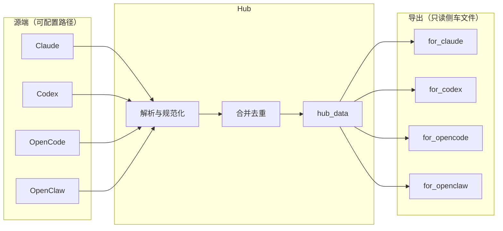

<p align="center">
  <strong>ai-memory-hub</strong>
</p>

<p align="center">
  将 <strong>Claude</strong>、<strong>Codex</strong>、<strong>OpenCode</strong>、<strong>OpenClaw</strong> 等平台产生的可移植记忆<br/>
  汇聚、去重、合并，并生成各端可安全引用的 Markdown — 不写坏厂商私有状态库。
</p>

<p align="center">
  
  
  
</p>

---

## 功能一览

| 能力 | 说明 |
|------|------|
| 多源采集 | 支持 `glob`、显式 `files`、目录 `scan_dirs` + 扩展名过滤 |
| 路径兼容 | `${VAR}`、`%VAR%`、`~/`、`**` 递归 glob；全局与各源 `exclude_globs` |
| 格式解析 | Markdown（含 YAML frontmatter）、JSON / NDJSON、可选按 `##` 切段（适合 OpenClaw 日记） |
| OpenClaw 增强 | 自动从文件名提取日期、从正文提取 `#hashtag` 标签、智能拆分保留日期上下文 |
| 合并去重 | 规范化正文 + Unicode NFC，合并 `sources` 与时间元数据 |
| 安全导出 | 仅写入 `hub_data` 与 `export/` 下可读注入文件，**不覆盖**如 Codex 官方 memories 目录 |
| 自动同步 | `watch` 基于文件 mtime/size 指纹轮询，变更后自动 `sync`（纯标准库定时，无额外依赖） |
| 可观测 | `discover` 列文件、`doctor` 做干跑体检（CI 友好）、`meta.json` 记录 schema 与统计 |

以上为仓库内已实现能力；克隆后安装依赖并配置路径即可运行（见下文）。

---

## 工作流程



---

## 安装

```bash
git clone <你的仓库地址> ai-memory-hub
cd ai-memory-hub
pip install -e .
```

仅参与开发与跑测试时：

```bash
pip install -e ".[dev]"
```

安装完成后可使用终端命令 **`memory-hub`**（与 `python -m memory_hub` 等价）。

---

## 三步上手

```bash
# 1. 生成配置模板（写入当前目录 config.yaml）
memory-hub init

# 2. 编辑 config.yaml：至少修正 OpenClaw 工作区、本机 Claude/Codex/OpenCode 路径

# 3. 体检 → 看命中文件 → 同步
memory-hub doctor -c config.yaml
memory-hub discover -c config.yaml
memory-hub sync -c config.yaml
```

无源文件命中时 `doctor` 会返回**非零退出码**，可直接用于 CI。

---

## 命令参考

| 子命令 | 作用 |
|--------|------|
| `memory-hub init [--dir DIR] [--force]` | 从包内模板生成 `config.yaml` |
| `memory-hub doctor -c config.yaml` | 检查各启用源是否匹配到文件 |
| `memory-hub discover -c config.yaml` | 打印匹配到的文件列表（每条源最多展示 50 条） |
| `memory-hub sync -c config.yaml` | 拉取、合并、写 `hub_data` 与各端 `export` |
| `memory-hub sync … --dry-run` | 只更新 `hub_data`，不写 `export` |
| `memory-hub sync … -v` | verbose：每源条数与解析失败详情 |
| `memory-hub watch -c config.yaml [-i 秒] [--dry-run] [-v]` | 轮询变更并自动同步 |

全局选项：`memory-hub --version`。

---

## 配置要点（`config.yaml`）

根字段 `hub_data_dir`：汇聚数据目录（相对路径相对于配置文件所在目录）。

**`defaults`（可选）**

| 键 | 含义 |
|----|------|
| `min_body_chars` | 过短片段丢弃阈值 |
| `parser` | `auto` / `markdown` / `json` / `text` |
| `split_level2_headings` | 是否按二级标题拆成多条 |
| `extract_date_from_filename` | 从文件名提取日期（支持 `YYYY-MM-DD` 格式） |
| `extract_hashtags` | 从正文提取 `#hashtag` 标签 |
| `exclude_globs` | 全局排除（如 `.git`、`node_modules`） |

**每个源（`claude` / `codex` / `opencode` / `openclaw`）**

| 键 | 含义 |
|----|------|
| `enabled` | 是否启用 |
| `glob_paths` | glob 列表 |
| `files` | 显式文件路径列表 |
| `scan_dirs` | `{ path, recursive, extensions }` 树形扫描 |
| `exclude_globs` | 仅针对该源的排除 |
| `min_body_chars` / `parser` / `split_level2_headings` | 可覆盖 `defaults` |
| `extract_date_from_filename` / `extract_hashtags` | 可覆盖 `defaults` |

**`export`**：`for_claude`、`for_codex`、`for_opencode`、`for_openclaw` 四个输出目录，用于写入注入用 Markdown。

完整说明与架构见 **[DESIGN.md](DESIGN.md)**。根目录 **[config.example.yaml](config.example.yaml)** 与包内 `memory_hub/data/config.example.yaml` 内容一致，供对照编辑。

---

## 产物目录（默认 `./hub_data`）

| 路径 | 内容 |
|------|------|
| `merged.json` | 合并后的结构化条目（数组，便于 jq/脚本） |
| `MERGED.md` | 人类可读的合并文档 |
| `meta.json` | `schema_version`、生成时间与按源计数 |
| `snapshots/*.json` | 各源本次拉取快照 |
| `export/for_*` | `SHARED_CONTEXT.md`、`hub-import.md`、`MEMORY.injection.md` 等 |

即使当前无条目，导出文件仍会生成并带占位说明，便于各工具稳定引用路径。

---

## 仓库结构

```
ai-memory-hub/
├── pyproject.toml          # 包元数据、console_scripts、pytest 路径
├── requirements.txt        # 运行时最低依赖（与 pyproject 一致）
├── config.example.yaml     # 配置样例（与包内 data 同步）
├── DESIGN.md               # 设计、兼容策略与规划
├── README.md               # 本文件
├── src/memory_hub/         # 包源码
│   ├── data/config.example.yaml
│   ├── __main__.py         # CLI 入口
│   ├── pipeline.py         # 同步流水线
│   ├── collect.py / paths.py / merge.py / …
│   └── …
└── tests/                  # pytest
```

---

## 测试

在项目根目录执行：

```bash
pip install -e ".[dev]"   # 或: pip install pytest pyyaml && pip install -e .
pytest
```

`pyproject.toml` 里已配置 `pythonpath = ["src"]`，测试进程可直接从源码树解析 `memory_hub` 包。

---

## 运行前提小结

- **Python** 3.10+
- **依赖**：`PyYAML`（安装包时自动安装）
- **配置**：有效 `config.yaml` 且至少一端路径能命中真实文件；否则合并结果为空，但流程仍可跑通
- **平台**：Windows / macOS / Linux；路径占位符按各平台惯例解析

若你后续把项目推到 Git，可把徽章中的仓库地址、CI 状态等换成真实链接。
